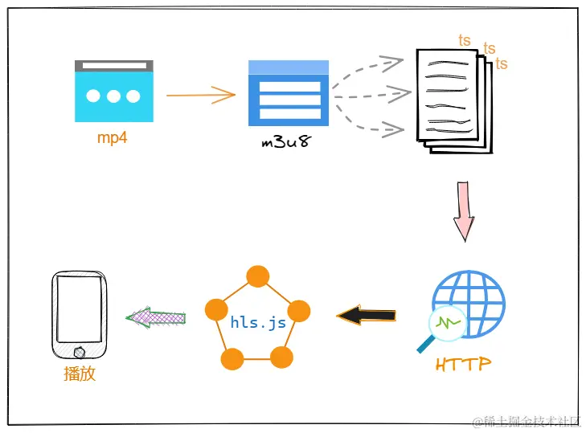

:::tip

算是系列文章，之前也弄过一个更简单的案例 [flask 实现简易视频播放网站案例](/posts/flask-video.md)

:::

# 从零开始做一个 m3u8 视频播放网站（案例）

很早之前就想做一个自己的视频播放平台，但是因为技术不够，总是会遇到各种问题。

最近有心血来潮，然后就看了相关的文章准备开始做了。

## 前言

关于做视频网站，一般都是长视频网站，需要考虑流畅的播放视频。原生的 `vedio` 视频标签虽然可以对视频进行播放，但是对长视频支持不是很友好，所以一般不考虑直接使用。

目前主流的视频网站，都是采用 `m3u8` 的格式进行播放。也就是将一个长视频用 `ffmpeg` 分割为一个个小片段，例如 10s
为一段，每一段都是 `ts` 格式的视频文件。播放器根据进度请求对应的片段或者提前请求相应的 `ts` 视频，从而实现流畅播放。

## HLS

`HLS` 是一种基于 `HTTP` 的流媒体传输协议，可以实现流媒体的直播和点播，其工作原理就是把整个视频流分成一个个基于 `HTTP`
的文件，每次只下载一部分

`HLS` 协议是由苹果提出的，它包括三个部分：

1. `HTTP`：传输协议
2. `m3u8`：索引文件
3. `ts`文件：音视频媒体信息

其中，`m3u8` 是一种 `UTF-8` 编码的索引纯文本文件，它就像一个播放列表，记录了一段段的视频流 ts 文件

前端首先解析 `m3u8` 文件，然后通过 `HTTP` 请求分片内容即 `ts` 文件，然后再使用 `MSE` 的 `appendBuffer` 进行 `buffer`
的封装，完成合流的工作，最后交给播放器进行播放

### 实现



我们上传的通常是一个 `mp4` 格式的文件，那么就需要将其进行分片，而 `FFmpeg` 能够实现将 `mp4` 转换为 `HLS` 文件

`FFmpeg`是一个用于操作、转换流媒体的命令行工具

首先需要先安装 `FFmpeg`，控制台执行：`ffmpeg` 不会报错即为安装成功

需要先安装 [FFmpeg](https://ffmpeg.org/)

### 视频处理

第一步：先将 mp4 视频转化成一个ts文件

```shell
ffmpeg -y -i vedio.mp4 -vcodec copy -acodec copy -bsf:v h264_mp4toannexb index.ts
```

`-bsf:v h264_mp4toannexb` 设置比特流过滤器

运行前面一句指令之后，会在当前目录下生成一个 `index.ts` 的视频文件

第二步：将改 ts 文件切成一段一段的小 ts 文件，并将各个 ts 文件信息存放到一个 m3u8 格式的文件

```shell
ffmpeg -i index.ts -c copy -map 0 -f segment -segment_list index.m3u8 -segment_time 10 "index-%04d.ts"
```

此处将视频分成每 10 秒为一个 `ts` 文件

### 视频播放

```html

<script src="https://cdn.jsdelivr.net/hls.js/latest/hls.min.js"></script>
<video id="video" controls></video>
<script>
    if (Hls.isSupported()) {
        var video = document.getElementById('video');
        var hls = new Hls();
        hls.loadSource('/static/video/index.m3u8');
        hls.attachMedia(video);
        hls.on(Hls.Events.MANIFEST_PARSED, function () {
            video.play();
        });
    }
</script>
```

## 网站 demo

前端使用 [layui ](https://layui.dev/)，后端采用 flask 。

1. 项目初始化

   ```python
   from flask import Flask, render_template, request
   from flask import Flask
   from flask_sqlalchemy import SQLAlchemy
   import sqlalchemy as sa
   
   # 创建应用程序 app
   app = Flask(__name__)
   # 配置 SQLite 数据库, 默认存放在 app instance 文件夹下
   app.config["SQLALCHEMY_DATABASE_URI"] = "sqlite:///project.db"
   # 图片默认的上传地址
   app.config["UPLOAD_FOLDER"] = "static/upload/video"
   
   # 创建拓展插件实例
   db = SQLAlchemy()
   # 将拓展插件对象绑定到程序实例
   db.init_app(app)
   ```

2. 创建数据模型

   ```python
   class MovieORM(db.Model):
       __tablename__ = "movie"
       id = sa.Column(sa.Integer, primary_key=True, autoincrement=True)
       name = sa.Column(sa.String(255), nullable=False)
       url = sa.Column(sa.String(255), nullable=False)
       m3u8_url = sa.Column(sa.String(255), nullable=True)
       create_at = sa.Column(sa.DateTime, default=datetime.now)
   
   ```

3. 自定义指令初始化数据库

   ```python
   @app.cli.command()
   def create():
       db.drop_all()
       db.create_all()
   
   ```

### 前端上传

因为网站里面现在没有视频数据，所以先编写上传页面

1. 后端上传路由

   ```python
   @app.get("/upload_movie")
   def upload_movie():
       return render_template("video_upload.html")
   
   ```

2. 前端页面编写

   ```html
   <!DOCTYPE html>
   <html lang="zh-CN">
     <head>
       <meta charset="UTF-8" />
       <title>上传视频 | 正心的视频播放网站</title>
       <!-- 引入 layui.css -->
       <link
         href="//unpkg.com/layui@2.8.18-rc.2/dist/css/layui.css"
         rel="stylesheet"
       />
       <style>
         .title {
           margin-top: 100px;
           text-align: center;
           font-size: 52px;
         }
       </style>
     </head>
     <body>
       <div class="layui-container">
         <h2 class="title">上传视频文件</h2>
         <div style="width: 50%; margin: 0 auto">
           <button
             type="button"
             class="layui-btn demo-class-accept"
             lay-options="{accept: 'video'}"
           >
             <i class="layui-icon layui-icon-upload"></i>
             上传视频
           </button>
         </div>
       </div>
       <!-- 引入 layui.js -->
       <script src="//unpkg.com/layui@2.8.18-rc.2/dist/layui.js"></script>
       <script>
         layui.use(function () {
           var upload = layui.upload;
           var layer = layui.layer;
           // 渲染
           upload.render({
             elem: ".demo-class-accept", // 绑定多个元素
             url: "/video_upload", // 此处配置你自己的上传接口即可
             accept: "file", // 普通文件
             done: function (res) {
               layer.msg("上传成功");
               console.log(res);
             },
           });
         });
       </script>
     </body>
   </html>
   
   ```

### 后端接收文件

后端需要做以下几件事情：

1. 接收前端的视频文件
2. 将视频处理为 m3u8 格式
3. 保存数据并返回结果

```python
@app.post("/video_upload")
def upload_movie2():
    file = request.files["file"]
    if file:
        """接收并保存视频文件"""
        filename = file.filename
        # 读取视频内容
        content = file.read()
        # 获取视频的 md5 值
        hex_name = hashlib.md5(content).hexdigest()
        # 获取文件后缀
        suffix = pathlib.Path(filename).suffix
        # 拼接新的名字 hex + 原有后缀
        new_filename = hex_name + suffix
        upload_dir = pathlib.Path(app.config["UPLOAD_FOLDER"])
        # 获取写入地址
        new_path = upload_dir.joinpath(new_filename)
        # 写入文件
        open(new_path, mode="wb").write(content)

        """处理为 m3u8 视频格式"""
        # 构建 m3u8 视频存放目录
        m3u8_path = upload_dir.parent.joinpath("m3u8")
        if not m3u8_path.exists():
            m3u8_path.mkdir()

        current_dir = m3u8_path.joinpath(hex_name)
        if not current_dir.exists():
            # m3u8 处理
            current_dir.mkdir()

        # 指令1 生成 ts 文件
        cli1 = f"ffmpeg -y -i {new_path} -vcodec copy -acodec copy -bsf:v h264_mp4toannexb {str(current_dir)}/index.ts"
        os.system(cli1)

        # 指令2 分割 ts 片段， 生成 m3u8 索引文件
        cli2 = f'ffmpeg -i {str(current_dir)}/index.ts -c copy -map 0 -f segment -segment_list {str(current_dir)}/index.m3u8 -segment_time 10 "{str(current_dir)}/index-%04d.ts"'
        os.system(cli2)

        # 创建模型并保存到数据库
        mv = MovieORM()
        mv.url = "/" + str(new_path)
        mv.name = filename
        mv.m3u8_url = "/" + str(current_dir) + "/index.m3u8"
        db.session.add(mv)
        db.session.commit()

    return {"code": 0, "msg": "上传视频成功"}

```

### 视频文件展示

1. 后端返回视频文件列表

   ```python
   @app.route("/")
   def hello_world():
       q = db.select(MovieORM)
       movie_list = db.session.execute(q).scalars()
       return render_template("index.html", movie_list=movie_list)
   
   ```

2. 前端显示视频表格

   ```html
   <!DOCTYPE html>
   <html lang="zh-CN">
     <head>
       <meta charset="UTF-8" />
       <title>正心的视频播放网站</title>
       <link rel="stylesheet" href="//unpkg.com/layui@2.8.18-rc.2/dist/css/layui.css" />
       <style>
         .title {
           margin-top: 100px;
           text-align: center;
           font-size: 52px;
         }
       </style>
     </head>
     <body>
       <h2 class="title">正心の专属视频播放网站</h2>
   
       <div class="layui-container">
         <div class="layui-form" style="width: 80%; margin: 20px auto">
           <div class="layui-form-item">
             <div class="layui-input-group">
               <input type="text" placeholder="请输入电影名" class="layui-input" />
               <div class="layui-input-suffix">
                 <button
                   type="submit"
                   class="layui-btn"
                   lay-submit
                   lay-filter="demo1"
                 >
                   点击搜索
                 </button>
                 <a
                   href="/upload_movie"
                   class="layui-btn layui-btn-primary layui-border-green"
                   >我要上传</a
                 >
               </div>
             </div>
           </div>
         </div>
   
         <table class="layui-table" style="width: 80%; margin: 0 auto">
           <colgroup>
             <col width="300" />
             <col width="180" />
             <col />
           </colgroup>
           <thead>
             <tr>
               <th>电影名</th>
               <th>上传时间</th>
               <th>观看</th>
             </tr>
           </thead>
           <tbody>
             
             <tr>
               <td>{{ movie.name }}</td>
               <td>{{ movie.create_at.strftime('%Y-%m-%d %H:%M:%S') }}</td>
               <td>
                 <a
                   href="/video_view?video_id={{ movie.id }}"
                   class="layui-btn layui-btn-sm"
                   >点击观看
                 </a>
               </td>
             </tr>
             
           </tbody>
         </table>
       </div>
   
       <script src="//unpkg.com/layui@2.8.18-rc.2/dist/layui.js"></script>
     </body>
   </html>
   ```

### 前端播放视频

1. 后端查询并返回视频内容

   ```python
   @app.route("/video_view")
   def video_view():
       vid = request.args.get("video_id")
       video = MovieORM.query.get(vid)
       return render_template("video_view.html", url=video.m3u8_url)
   
   ```

2. 前端进行视频播放

   ```html
     <body>
       <video id="video" controls style="width: 1280px"></video>
       <script src="https://cdn.jsdelivr.net/hls.js/latest/hls.min.js"></script>
       <script>
         if (Hls.isSupported()) {
           var video = document.getElementById("video");
           var hls = new Hls();
           hls.loadSource("{{url}}");
           hls.attachMedia(video);
           hls.on(Hls.Events.MANIFEST_PARSED, function () {
             video.play();
           });
         }
       </script>
     </body>
   ```

# 总结

实现流媒体的播放，主要有两步：

1. 后端利用 `FFmpeg` 工具将 `mp4` 转换成 `m3u8` 格式的文件
2. 前端通过 `hls.js` 逐段请求 `ts` 文件，并合成为视频流，交给播放器进行播放

比起传统的方式，流媒体传输可以实现视频的流畅播放，支持视频的点播、直播等；不仅如此，客户端还可以根据网络宽带
请求不同码率的视频文件（标准、高清、超清...）

**优化点：**

1. 前端上传视频，后端接收视频文件，返回结果，等待转码（发布一个消息队列）。
2. 视频转码成功，修改数据库数据。

## 附录

源码地址： [案例源码](https://github.com/zhengxinonly/zhengxin_collection/tree/main/flask-m3u8-video)

参考文章：

1. [【前端】如何流畅地播放视频](https://juejin.cn/post/7283813865720184871)
2. [Web 视频播放的那些事儿](https://juejin.cn/post/6844904117605761031)
3. [媒体处理-音视频 HLS 加密服务设计](https://juejin.cn/post/7066670799259697159)
4. [付费视频被人薅走？了解一下hls视频加密](https://juejin.cn/post/7177643022060879928)

