:::tip
[BV1Gg4y1o76G](https://www.bilibili.com/video/BV1Gg4y1o76G/)
:::

# windows 11 安装 WSL

在学习编程的道路上，Linux 总是一个无法回避的问题。世界上绝大部分服务器都是 Linux 系统，很多软件编译工具只有在 Linux
下才有完备的功能，一些最新的软件工具也是 Linux 首发。

Linux 拥有最好的开发体验，Linux 的指令简洁而功能强大。但是它对日常办公（视频剪辑、文稿处理）、游戏娱乐支持确实一塌糊涂。而
Windows 拥有最好的日常办公与游戏娱乐支持，但是很多强大的开发工具无法使用。

很久以前我就来来回回在 Windows 与 Linux 之间折腾，曾经无数次内心骂骂咧咧的地在 Windows 下远程 Linux 服务器测试代码，也时常
Linux 真级下羡慕 Windows 的各种办公、娱乐软件。

直到我遇到了 WSL，虽说她还是有不少的毛病，只要到嘴的内存就不肯释放，偶尔会闹小脾气导致软件出现莫名奇妙的问题。但是可取之处还是非常多，可以兼容绝大部分的开发工具，可以在
Windows 享受到 Linux 的大部分开发体验。

WSL 的全称是 Windows Subsystem for Linux，是一个在 Windows 上能够运行原生 Linux 二进制可执行文件的兼容层。

## windows 设置

在安装 wsl 子系统前，需要对 windows 进行一些设置。

### 开启虚拟化

win + i 快捷键，然后搜索 `控制面板` 并进入

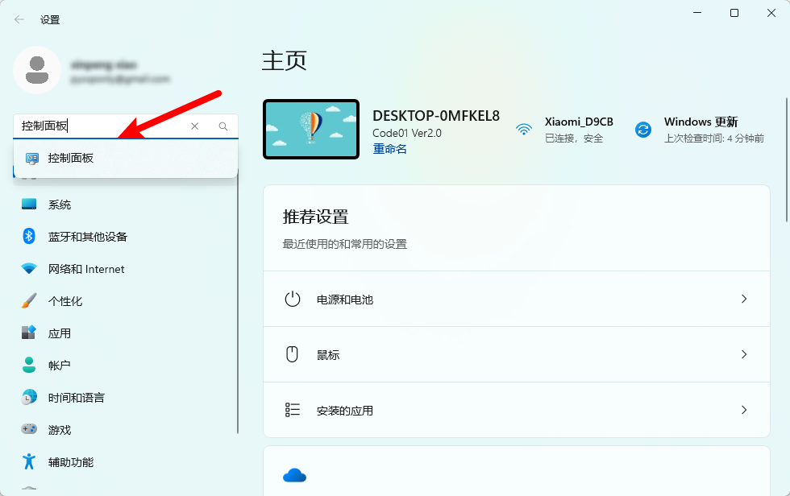

进入控制面板之后，点击 `程序与功能`

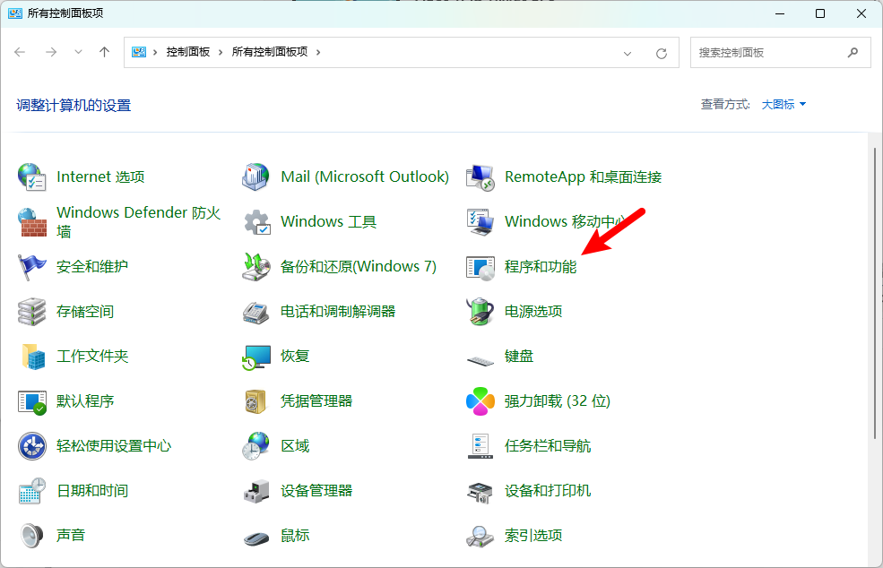

点击启用 `启用或关闭 Windows 功能`

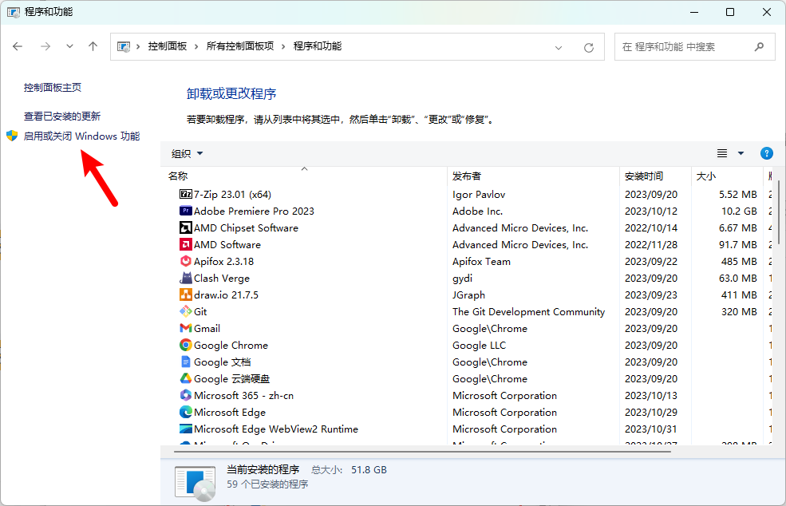

勾选 `适用于 Linux 的 Windows 子系统` 和 `虚拟机平台`

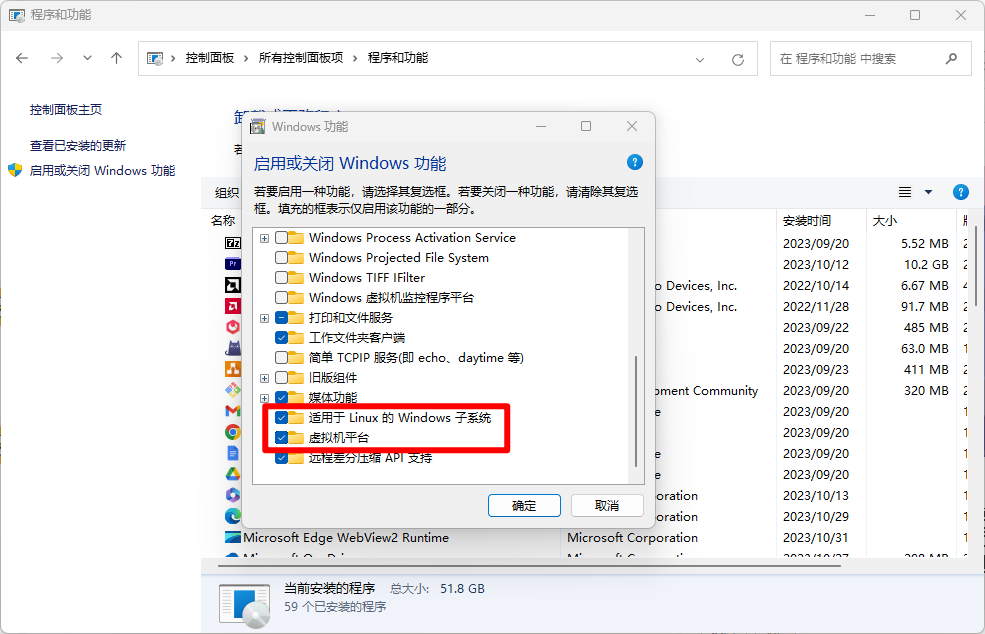

之后确定并且重启

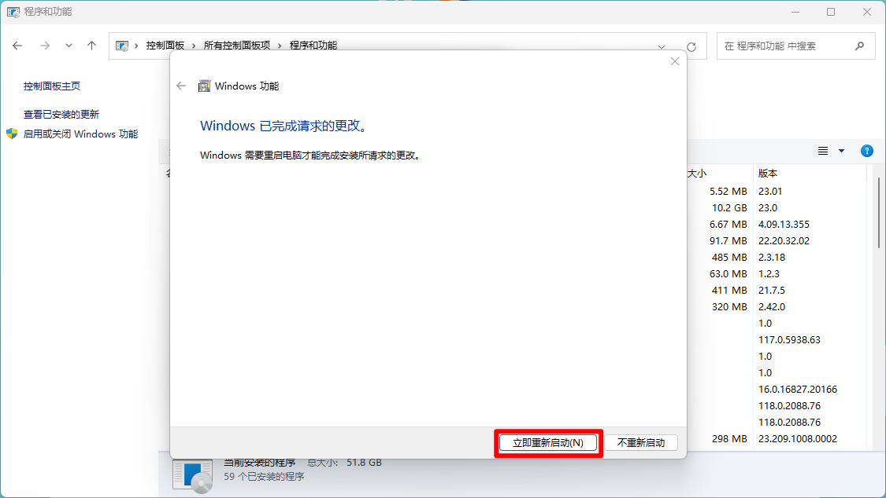

## 软件安装

软件安装可以使用 wsl 指令在命令行下进行安装，也可以在微软商店进行安装。关于指令在后面我们会讲，所以先试用微软商店进行安装。

快捷键 win + q 输入 `microsoft Store` 打开微软商店


搜索 `ubuntu` 点击获取。ubuntu 有很多的版本，建议选择较新的版本，版本之间的差距不是很大。


点击获取、安装，然后等待安装完之后打开，下载完成打开 `ubuntu`

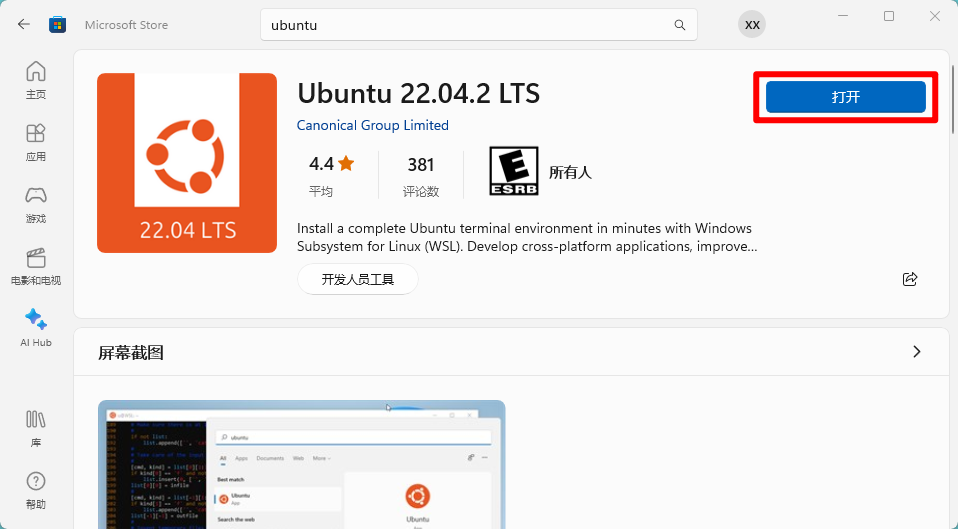

第一次安装可能遇到与我一样的错误，如果没有就跳过，如果有就需要安装一个东西解决。原因的话是因为是需要将 wsl 升级到 wsl 2
的版本。


> 出现错误之后的解决方案：
>
> 1. 复制并访问地址 https://aka.ms/wsl2kernel
>
> 2. 下载并安装 wsl 2 的升级软件
     >
     >    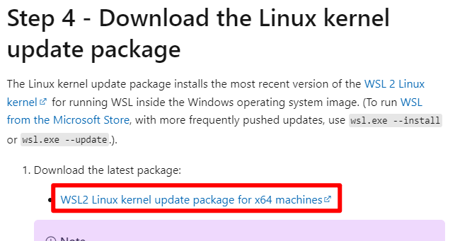
>
> 3. 在命令行下设置 wsl 的默认使用版本
     >
     >    ```
     > wsl --set-default-version 2
     >    ```
>
> 4. 然后重新打开 ubuntu，显示正在安装就没有问题了

安装完之后输入账户名与密码。需要注意的是密码输入的时候并不会显示内容，直接回车就可以了。

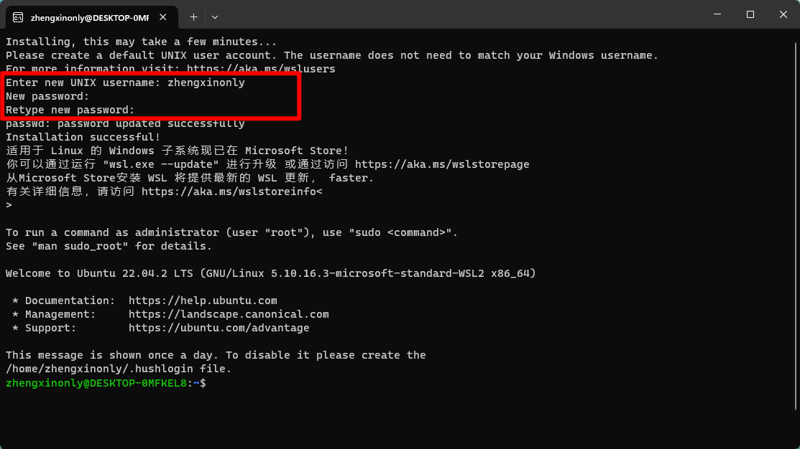

默认会直接进入到 wsl 系统里面，就可以直接使用了。

也可以通过 `win + q` 搜索 `ubuntu` 打开使用。

### 修改终端

win 11 默认的终端是 power shell ， 可以将其修改为 wsl 。

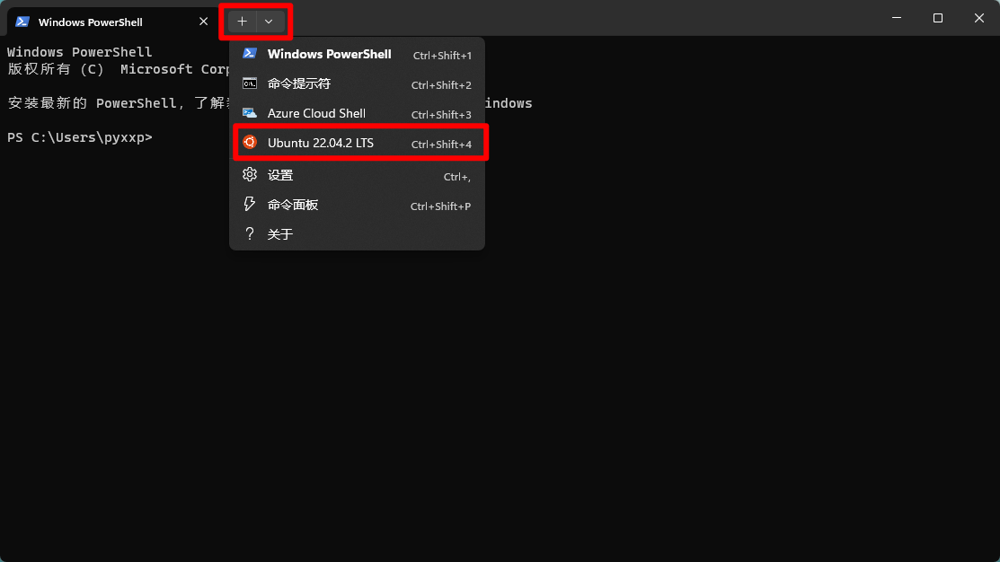

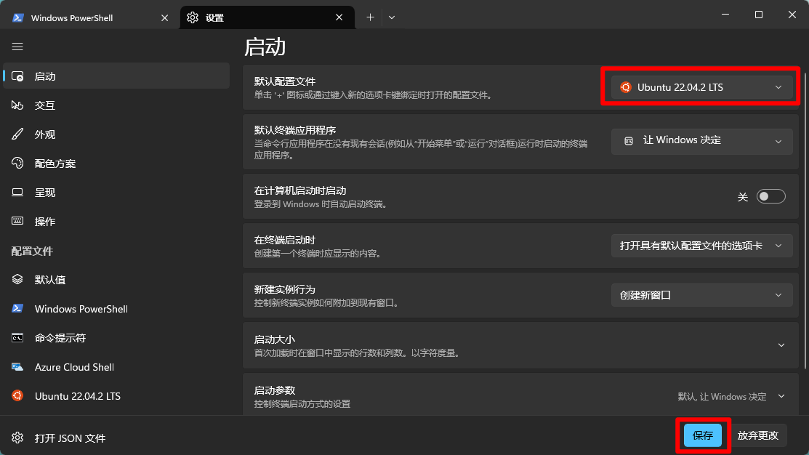

然后 win + q 输入`终端` 打开就会是 wsl 的终端了。

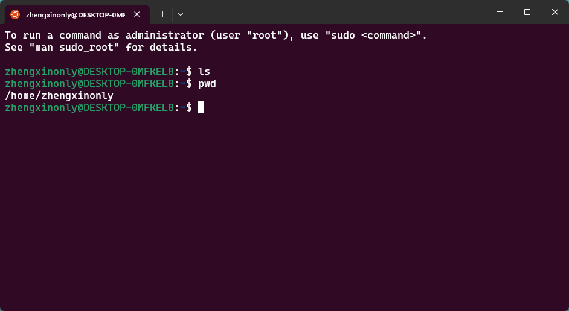

在里面直接使用 Linux 指令就可以了。
