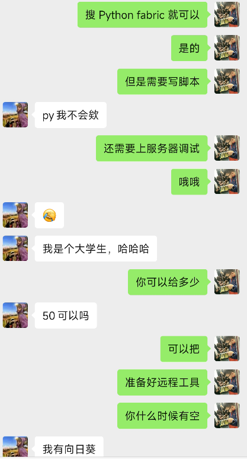
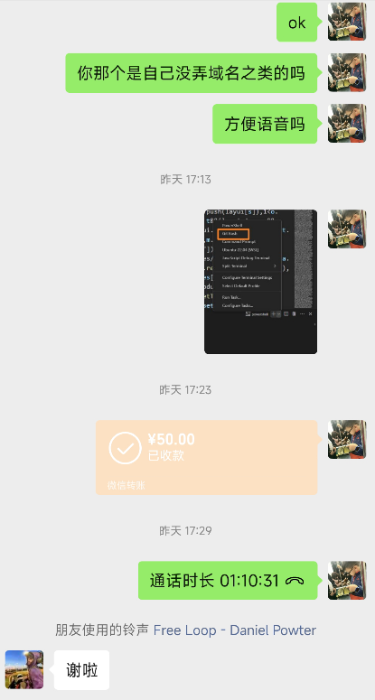

# 一句代码十块钱，总共写五句，你愿意做吗？

## 起因

在我之前录制的 VitePress 系列教程中，使用了一个远程部署的脚本，有粉丝看到了之后就询问我是怎么做的，愿意有偿。


看到消息之后，我也没有太多的想法，因为这种情况之前已经被骗过很多次了。但是他的态度比较好，我还是给他回了消息，然后关了 B 站
APP。

再次打开时，看到的是具体的需求，并且附带一个微信，觉得还是蛮方便的，于是就加了微信。


## 需求沟通

加上微信之后，就先沟通了一下需求


大概的需求就是能够将本地弄好的内容部署到远程服务器上，主要是 vue 打包之后的产物与 jar 包之类的东西。

对于这种小外包，一般很少接。虽然简单，但是钱一般不多。我也懒得问价了，就直接指导他如何去做。



需求整体很简单，代码量也非常的少，不超过十行，核心代码也就五六行。

就是使用 Python fabric 工具包将打包之后的产物上传到服务器，然后将 NGINX 中旧的部署文件删除，把新的部署文件拷贝进去就可以了。

## 完成需求

但是他对这一块并不会，我就问了一下价格，价格勉强能接受，就顺手给他远程做了。



然后一边语音一边写代码，顺便问了一些关于技术的其他问题，聊了 Java、前端、go、Linux 的一些东西，顺便给了他一些学习建议。

整个需求的完整代码如下：

```python{6,8-11}
import os
from fabric import Connection

os.system('tar -zcvf dist.tar.gz dist/')

conn = Connection(host='username@host', connect_kwargs={"password": ""})

conn.put('dist.tar.gz', 'dist.tar.gz')
conn.run('tar -zxvf dist.tar.gz -C .')
conn.run('sudo rm -rf /var/www/notes')
conn.run('sudo mv dist /var/www/notes')
conn.run('rm -rf dist')
conn.run('rm -rf dist.tar.gz')
os.system('rm -rf dist.tar.gz')
```

内容并不多，但是花了将近一个小时。

你们觉得这个时间久吗？

以及这个小外包价格贵吗？

欢迎在视频下方留言。
