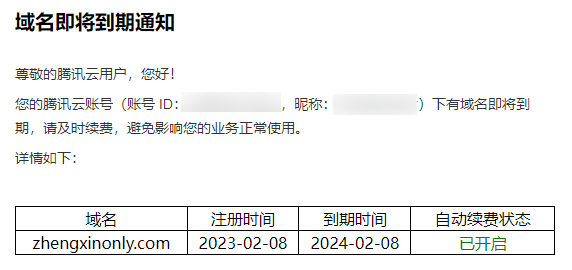
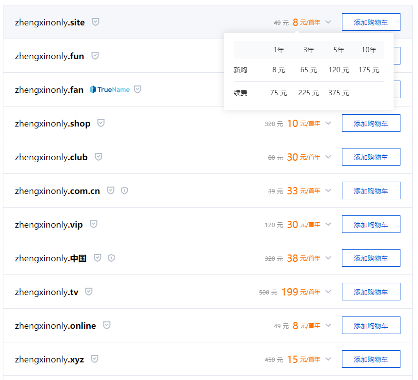
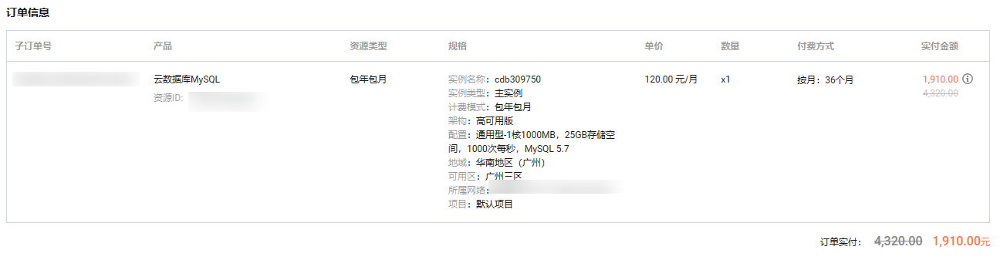

# 域名过期了，腾讯云通知我续费。盘点我在云服务器上的一年开销

先上两张图

自从用过云服务器之后，这一块的支出就再也没有无法避免了。虽然虚拟机免费，但是用起来实在麻烦。云服务器虽然要花钱，但是有一台
7x24 小时运行的机器，有一个 IPV4 地址，搭配域名、cos、云数据库之类的工具用起来十分方便。不管是学习还是部署项目，再也回不去虚拟机时代了。

## 个人推荐的云服务

很多人从学生时代开始就学习编程，然后就会接触服务器、虚拟机。其实有一些云服务的性价比非常高，不管是学习、工作都非常推荐。

### 服务器

在学习编程的道路上，Linux 永远是迈不过去的砍。而有一台云服务器，不仅可以解决初期学习的问题，还可以积累云服务器的使用经验，
等到工作或者是想要搭建、部署自己的服务是也可以很方便。

对于我自己来说，手上其实有好几台服务器。初期学习与部署项目，直接购买云服务商最便宜、最低配的服务器就够用了（docker
等需要高性能的服务会很卡）。

这一块的支出在我这里其实不低

里面其实部署了两个静态站点，一个 web 后台管理项目，还有一个后台接口项目。没有安装 MySQL 数据库，使用了云 MySQL 数据库与
sqlite 进行代替。

### 域名

域名是我首推的，例如我现在使用的域名 zhengxinonly.com 每年是 85 块钱的支出。
腾讯云的价格稍微贵一点，也有一些其他的服务商性价比更高，但是我用腾讯云很多年了，对它比较熟悉懒得换了。

如果你觉得贵，其实也可以换成其他后缀的，价格会便宜许多。

首年价格很优惠，后面续费就是正常价格了。因为国内需要备案的原因，所以在购买域名的时候，一定不要只考虑价格，因为后面更换比较麻烦。选择域名的时候一定要慎重！！！

## 工作才需要的服务

这部分的服务初学者可能用不上，但是工作的时候还是蛮重要的。

### 静态资源存储

在搭建 web 服务的时候，经常需要存储一些静态资源（png、pdf、excel。。。），一些初学者一般会直接存在本地。当服务器不小心被重装，或者是服务器需要进行迁移的时候，就会非常麻烦。
使用腾讯云的 COS 或者阿里云 OSS 其实还是蛮方便的，这一部分主要是存储费用与流量费用，因为我目前资源量较少，主要是一些图片文件，一年也就几十块钱。

### 云数据库

其实也可以买一台服务器，然后再服务器里面安装 MySQL。但是我由于之前出过一次事故，不小心把服务器重装，导致丢失了一周的数据。
同时在初学时有一次被脱裤、勒索了，考虑到安全性，就再也不敢节约这部分的费用了。
目前云数据库的费用真心不低。

### 短信服务

使用短信服务，是很多网站的标配。个人的网站也可以使用短信进行登录。这一块的费可以按套餐或者是按条算，一条一毛钱，如果需要的数量够多（1万以上），最低可到三分钱。

## 总结

一年云服务的开支为 85（域名）+ 489.6（服务器）+ 47.44（静态资源存储）+ 636.7(云数据库 1910/3) = 1258.74

之前还不清楚自己搭建网站的费用，这样算下来，发现费用确实不低，做一年的 up 主收入都没这么多。

如果你觉得本视频对你有帮助，不放给我点赞三连，支持我创作更多的内容。