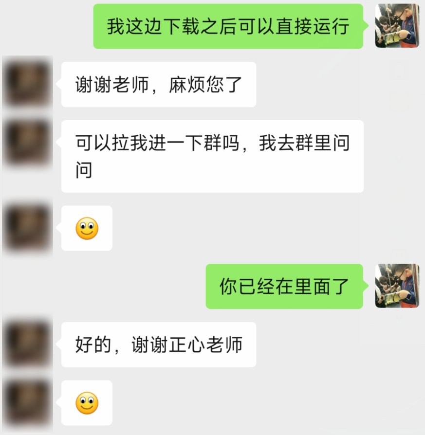
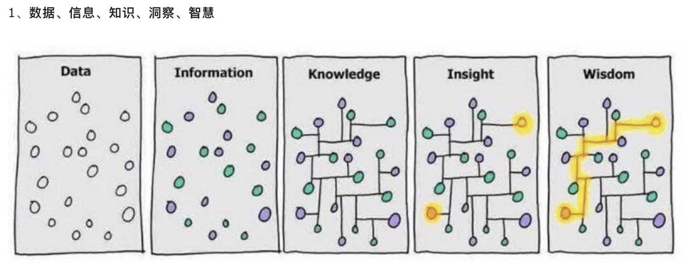
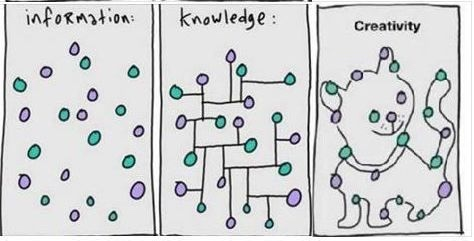

# 在问别人问题时，如何获取到别人的解答？

起因，是一个不清楚是不是我粉丝的人，加到我的微信，没头没尾的直接问我问题。因为只有一个报错，同时我还是在忙，就随便回了。
然后就收到两个微笑表情，当时情绪就有一点变化，想想也就算了。

针对这个问题，我们就展开聊一下，如何在互联网上尽量获取到别人的解答。

## 如何提问

首先思考三个问题：

1. 互联网上的陌生人有义务给你解答吗？
2. 如何高效的提问?
3. 如何提问才能尽量得到答案？

### 互联网上的陌生人有义务给你解答吗？

第一点：别说是互联网上的默认是，即使是同学、朋友、老师，就一定要帮你处理各种问题吗？肯定是不存在的。
在我们读书时，交钱去学校学习，学不会的单独问老师，老师会给你解答吗？
但是在互联网上，因为开源的缘故，很多人都享受了免费、优质的内容，其中就包括我，但是有很多人也因此习惯了白嫖。

然后在我们再思考一个问题，开源一定就意味着免费吗？免费视频、资料、源码，服务也要跟着免费吗？
互联网上不乏有一些人乐于助人，愿意把他们的时间、精力全部去帮助其他人。
我在这一行也见过很多这种项目的维护者，但是如果不能商业化基本是不可长久的。

帮我解答是情分，不给我解答是本分。在我学习编程的路上，对于那些给予过我帮助的人我非常感谢，对于那些没有伸出援手的人，我也能理解。
毕竟越是优秀的人，他们会更忙，他们的时间、精力理应花在他们感兴趣的地方。
很多时候他们能够抽出几秒中回复一个问题，但是不会长篇大论的跟你讨论一个问题，除非你的问题具有讨论的价值。

### 如何高效的提问?

关于这个问题，在互联网上很早之前就有过讨论，那就是[提问的智慧](https://github.com/ryanhanwu/How-To-Ask-Questions-The-Smart-Way/blob/main/README-zh_CN.md)。

在问问题之前，一定要先清楚自己在问什么，并且问题尽量在一两次交流以内就可以解决。每个人都有自己的工作要忙，抽空回复几句已经不容易了。

### 如何提问才能尽量得到答案？

互联网上乐于分享的还是有很多，但是愿意花十几分钟或者半个小时给你去解决问题的人很少。

如果你的问题能在一两句话之内解决，大概率能够得到你的答案。想让别人话十几分钟帮你解决问题，那就看你的问题是否能够引起别人的兴趣了。

并且问问题的时间也要对，有些人白天工作时才回复消息，有些人则下班后才有时间，甚至有些时候都不看消息，或者是看了消息也不想回。

## 我的分享习惯

在 B 站发视频，我一般会让加微信发一键三连截图之后才提供源码之类的。
所以偶尔也会有一些人问我问题，对于一些两三句话就能解决的问题，我看到消息之后就会顺手解决，但是占用时间超过两三分钟，可能就不会回消息了。

那么怎么能让自己的问题在两三分钟以内得到解答呢？如果是开放性问题，几乎很难得到解答，例如只发代码报错、问某个技术的优点与缺点、帮忙写一段代码之类的。

有一类问题很容易就可以得到解答，那就是询问问题出在那一块，大概需要补充什么知识能够得到解答，这种问题一般会帮对方定位到问题的所在，然后让其自己去想办法解决。

### 新手的问题一般出在哪里

新手 99% 的问题都是出在没有系统学习对应的知识上面。例如近段时间我遇到最多的问题就是关于 pear-admin-flask 这个框架上面。
不管是在 gitee issues 该是在我微信上问我，很多问题都是很基础的东西。
例如学习数据库之后肯定会知道约束、关系相关的知识，学习了 flask 肯定会清楚它的运行机制，学习过 Python 肯定懂它的深浅拷贝、装饰器等特性，并且做
web 对前端多多少少需要懂一些。但是很多人是压根没有想过问题会出在自己学过的知识点上。

基础不牢，地动山摇。

### 我的解答习惯

我很少给互联网上的陌生人回答长篇大论的问题，因为我不清楚他的背景、会那些东西，有时候回答一个问题之后引来的是无穷无尽的问题，但是能够顺手帮一下的，我依旧会进行解答。

之前在某在线教育公司任职的时候，我的解答习惯也都是在学员问我问题的时候，先会分析他的问题，然后再问询他的问题中需要的基础知识点是否掌握了，百分之九十的问题都可以得到解决。剩余的百分之十几基本就只能远程了。

### 最后建议

一定要先学基础，然后慢慢的深入学习，需要系统的学习。

慢即是快。