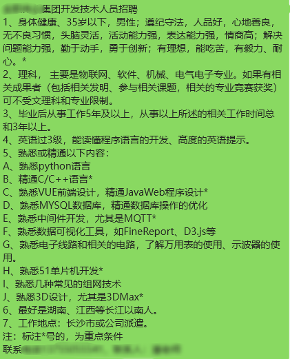
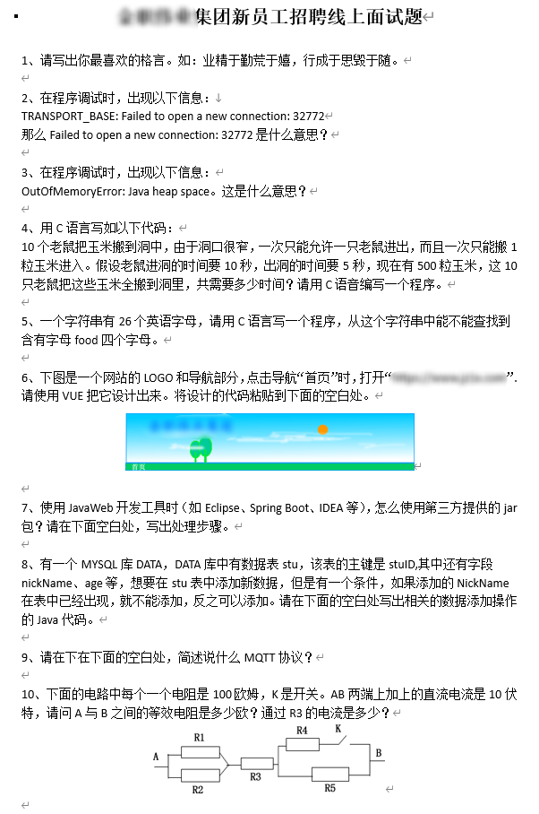
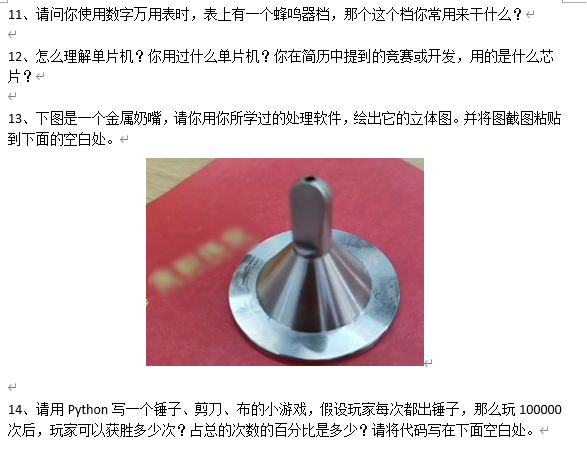

# 一次找工作经验分享

去年九月份离职，之后差不多躺平了三个月左右，原本准备年后再去深圳找工作，但因为实在无聊，偶然的看到一个转发的招聘需求。

通篇读下来，感觉大部分都有了解过，一些精通要求的我虽然达不到要求，就试着加微信好友，准备先聊聊，结果微信一直没有通过。

然后转发招聘需求的人在群里问了一句，然后就让我直接打电话。电话打过去忙线，打了两次还是忙线。后面收到对方的短信让我找另外一个人，
整个沟通下来感觉对方很忙，并且给我一个电话让我去找负责技术的人聊。

然后我就直接打电话过去了，聊了几句，加了微信，发了简历，就没怎么会消息了，等了两三天才跟我约面试。

## 面试

说远程我电脑进行写题，然后给了我一个 word 文档，让我两个小时内做完。

看这个题目，我觉得面试者还是非常有诚意的，题目的内涵涵盖很广，在考试之前还特意提醒提前安装好环境。

因为 Java、C 已经很久没用了，后面咨询过后，对应的题目可以 Python 写（出题者后面说只要精通一门语言，其他的学起来很快）。

花了一个半小时，把其他的题目全部搞定。然后就被困在 13 题了，原本想放弃，出题者提醒我还有半小时，我就尝试了一下，发现实现不了，在浪费
15 分钟之后就交卷了。

## 通知

大概过了两天，就已经拟录取了，告诉我第二天之后就会有通知。结果第二天没等到，我就问了一下，他就告知我一些入职之后的事情。
我就大概了解了工作的情况，要去长沙入职，然后外派到其他城市。

等到第三天时，人事来电话说面试通过，让我准备什么时候去报道，然后我就问了薪资、五险一金、工作时间等问题。
然后发现工资远低于我的预期，相比上一份工作算是大幅降薪。但是早八晚五、大小休的工作时间比我上一份工作好很多，节假日正常放，还有年假。

当时我也没有直接拒绝，因为之前面试时，我能感觉到面试官是一个懂技术的，就想考虑一下，说第二天给答复。

后面面试官了解情况之后，就找我聊他们项目的事情，我感觉其实还可以，然后就答应了。

## 后续

整个面试过程中，因为是熟人推荐，就免去了很多麻烦。不过还是要了大学时期的比赛证书，并且还问了相关的经历，以及之前的经历。

其实整个面试严格来算只有一轮，就是面试我的那个人。那个人是一个老头，搞物联网相关的，我能够通过面试的原因有二。

+ 物联网专业毕业的，大学时参加过竞赛并且获过奖
+ 开源项目 pear-admin-flask 框架

说实在的，因为这两点面试成功我也实数意外。在以前的我看来，大学时期参加比赛对我唯一的帮助就是培养了自己学习能力。
pear-admin-flask 开源项目其实也非常简单，比起我写在简历上的项目还要差不少。

后面知道录取的理由之后，也明白了。面试官是一个做物联网的大佬，比我爸还要大一辈，他其实对软件了解并不多，所以只能通过那些 `他能看懂的技术`
来区分面试者是否符合他的要求。

## 我的感触

整个面试过程还行，但是面试之后，发现与想象中的还是有一些差距。例如之前说我可以用 Python 重写旧项目，结果改成了必须要 Java。
后面又变成新项目用 Python 旧的必须 Java。

原本不知道公司的规模，入职时发现是一家中等规模的成长型公司。
并且我入职的部门是新成立的，软件开发就只有我一个，还入职了另外一个硬件开发，再加上面试官就三个技术人员。

再者就是工作时间的问题，之前以为是不加班，结果发现还是需要加班，同时没有加班费，但是可以调休。

整体来说还是蛮不错的，只需要做技术的感觉真的很不错。